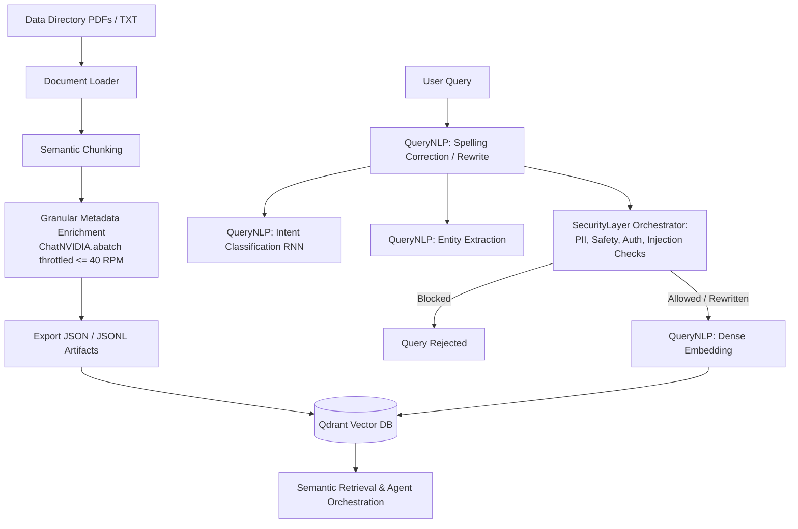

# Multi-Agent Orchestration with RAG & NVIDIA Builder Models

An enterprise-grade financial document ingestion, metadata enrichment, and retrieval pipeline powered by **NVIDIA AI Endpoints**, **Qdrant Vector Database**, and **PyTorch RNNs**.

---

## 🌟 Key Features

1. **Multi-Format Document Ingestion**:
   - Seamlessly extracts text and page metadata from PDFs, Markdown, and TXT files.
2. **Granular Metadata Enrichment (40 RPM Throttling)**:
   - Employs **`meta/llama-3.1-8b-instruct`** with Pydantic structured schemas via **`ChatNVIDIA.abatch()`** to deduce title, document type, legal entities, compliance mandates, and synthetic QA pairs.
   - Strictly throttled using a sliding 60-second window rate limiter to guarantee compliance with the **40 RPM** API quota limit.
3. **Semantic Chunking**:
   - Splits documents into semantically coherent units at contextual inflection points using **`nvidia/llama-nemotron-embed-1b-v2`** embeddings.
4. **Qdrant Vector Database Integration**:
   - High-performance, zero-setup local persistent vector indexing (`qdrant_indexer.py`).
   - Batches document ingestion (size 2048 dimensions) preserving all LLM-extracted metadata.
5. **QueryNLP Processing Pipeline (`QueryNLP/`)**:
   - **Intent Classification (PyTorch RNN)**: Triggers a Bidirectional LSTM trained over `distilbert-base-uncased` to detect user intent natively.
   - **Entity Extraction**: Uses NVIDIA structured outputs to parse domain entities dynamically from queries.
   - **Spelling Correction & Rewrite**: LLM-driven spell check and semantic expansion prior to vector retrieval.
   - **Dense Query Embedding**: Instantly generates embeddings via NeMo Retriever for hybrid searches.
6. **Unified Security Layer (`SecurityLayer/`)**:
   - **PII Guardrail**: Uses NeMo Guardrails to proactively detect and mask PII (e.g. Emails, Phones, SSNs, Persons, Organizations).
   - **Access Authorization**: Enforces strict Role-Based Access Control (RBAC) classifications to prevent unauthorized data retrieval.
   - **Content Safety Guard**: Blocks toxic, illegal, or unethical inputs seamlessly using LLaMA Content Safety endpoints.
   - **Prompt Injection Guard**: Detects and halts adversarial logic, jailbreaks, and overrides across both user queries and retrieved context.
   - **Security Orchestrator**: The master gateway that integrates all checks, failing-fast for malicious intent, or seamlessly invoking a Privacy Sanitizer LLM chain to rewrite and anonymize sensitive queries gracefully.

---

## 🛠️ Architecture Overview



---

## 📦 Setup & Installation

### 1. Clone & Install Dependencies
```bash
git clone https://github.com/Vaibhav2005-r/Multi_Agent-Orchestration_with_RAG_-_Neurals.git
cd Multi_Agent-Orchestration_with_RAG_-_Neurals
pip install langchain-nvidia-ai-endpoints langchain-core langchain-qdrant qdrant-client pypdf pymupdf python-dotenv pandas torch transformers nemoguardrails nest_asyncio
```
> **Note for Windows Users:** The `nemoguardrails` dependency (specifically the `annoy` package) requires [Microsoft C++ Build Tools](https://visualstudio.microsoft.com/visual-cpp-build-tools/) to be installed.

### 2. Configure Environment Variables
Create a `.env` file in the root directory:
```env
NVIDIA_API_KEY=nvapi-your_api_key_here
```

---

## 🚀 Running the Pipeline

### 1. Ingestion Pipeline
To process documents and enrich them into JSON artifacts:
```bash
python3 document_pipeline.py
```

### 2. Qdrant Indexing
To index the processed documents into your local Qdrant database:
```bash
python3 qdrant_indexer.py
```

### 3. QueryNLP Pipeline
You can test the individual modules of the Query Processing pipeline:
```bash
# Test PyTorch Intent Classification
python3 QueryNLP/query_classification.py

# Test LLM Entity Extraction
python3 QueryNLP/entity_extraction.py

# Test Spelling Correction & Qdrant Search
python3 QueryNLP/spelling_correction.py

# Test Query Enrichment (Semantic Expansion & Context-Aware Rewriting)
python3 query_enrichment.py
```

---

## 📄 License
MIT License
