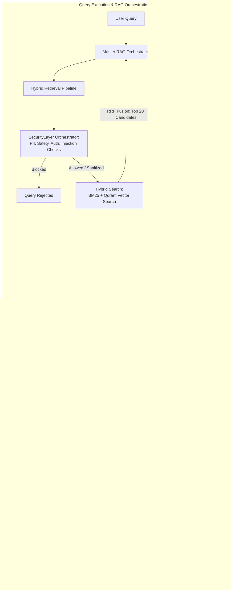

# Multi-Agent Orchestration with RAG & NVIDIA Builder Models

An enterprise-grade financial document ingestion, metadata enrichment, and retrieval pipeline powered by **NVIDIA AI Endpoints**, **Qdrant Vector Database**, and **PyTorch RNNs**. 

This system acts as a secure, intelligent backend that processes complex regulatory and financial documents, indexes them semantically, and orchestrates user queries through a rigorous pipeline of security guardrails, intent classification, query rewriting, hybrid search, and cascaded reranking.

---

## 🤖 Models Used & Their Purposes

This project heavily leverages NVIDIA AI endpoints and HuggingFace models for various discrete tasks, following a multi-agent architectural pattern:

### 1. `meta/llama-3.1-8b-instruct` (via NVIDIA API)
The primary workhorse LLM used for structured data extraction and logical reasoning across multiple modules:
*   **Document Pipeline (`document_pipeline.py`)**: Powers the `ChatNVIDIA.abatch()` calls to extract high-level document metadata (title, summary, domain) and granular chunk-level metadata (entities, synthetic QA pairs, compliance mandates) using strict Pydantic schemas.
*   **Query Enrichment (`query_enrichment.py`)**: Performs semantic expansion and context-aware query rewriting (based on chat history) to optimize the query for vector retrieval.
*   **Query NLP (`QueryNLP/entity_extraction.py`, `QueryNLP/spelling_correction.py`)**: Extracts named entities from raw queries and performs intelligent spelling correction.
*   **Security Layer**: Drives the logic for the `AccessAuthorizationGuard` (RBAC checking), `PromptInjectionGuard` (adversarial detection), and acts as the Privacy Sanitizer in the `SecurityOrchestrator` to rewrite queries that contain sensitive PII.

### 2. `nvidia/nv-embedqa-e5-v5` (via NVIDIA API)
*   **Semantic Chunking (`document_pipeline.py`)**: Used by the `SemanticChunker` to calculate semantic similarity between sentences, determining the optimal breakpoints to split documents contextually rather than arbitrarily.
*   **Vector Database Indexing (`qdrant_indexer.py`)**: Embeds the enriched document chunks into high-dimensional dense vectors to be stored in the persistent Qdrant database.

### 3. `nvidia/llama-nemotron-embed-1b-v2` (via NVIDIA API)
*   **Query Embedding & Deduplication**: A lightweight, highly efficient embedding model used specifically to vectorize incoming user queries rapidly for semantic matching, and for semantic deduplication of retrieved chunks.

### 4. `nvidia/llama-3.1-nemoguard-8b-content-safety` (via NVIDIA API)
*   **Content Safety Guard (`SecurityLayer/content_safety_guard.py`)**: A specialized NeMo Guardrails model used exclusively to detect and block toxic, illegal, or unethical content in user prompts.

### 5. `nvidia/llama-nemotron-rerank-1b-v2` & `FlashRank`
*   **Cascaded Reranking (`rag_retrieval/`)**: FlashRank (`ms-marco-MultiBERT-L-12`) is used locally to quickly filter candidates, followed by the heavy NVIDIA cross-encoder to precisely rerank the absolute best chunks for context assembly.

### 6. `distilbert-base-uncased` + Custom PyTorch BiLSTM
*   **Intent Classification (`QueryNLP/intent_detection.py`)**: A locally trained PyTorch model to classify user queries into specific domain intents (e.g., *Regulatory Guideline*, *Annual Report*).

---

## 📦 Module Usage & Architecture



### 🏗️ Detailed System Workflow Architecture

The currently implemented orchestration pipeline seamlessly strings together several modules to execute a flawless context assembly process:

1. **Master RAG Orchestrator (`rag_retrieval/master_orchestrator.py`)**: The central nervous system of the RAG retrieval flow. It receives the raw user query and manages the entire lifecycle of the retrieval process.
2. **Security & Guardrails (`SecurityLayer/`)**: The query is immediately passed into the `HybridRetrievalPipeline`, which first routes it through the `SecurityOrchestrator`. Using NVIDIA NeMo Guardrails, it scans for prompt injection attacks, toxic content, and strictly enforces Role-Based Access Control (RBAC). If Personally Identifiable Information (PII) is detected, it is immediately masked/sanitized via LLM rewriting.
3. **Hybrid Fetching**: Once sanitized, the query executes a BM25 sparse keyword search alongside a Qdrant dense vector search. The results are fused using Reciprocal Rank Fusion (RRF) to pull a broad set of ~20 candidate chunks.
4. **Semantic Deduplication**: Compares the cosine similarity of the candidates using the `llama-nemotron-embed` model and drops redundant overlapping text.
5. **Cascaded Reranking**: 
    *   Passes the remaining unique chunks through `FlashRank` (a lightning-fast local model) to narrow the pool down to the Top 10.
    *   Passes those Top 10 to the heavyweight `NVIDIA Cloud Cross-Encoder`, which rigorously scores them and selects the absolute Top 3 most relevant chunks.
6. **Context Packaging**: Feeds the Top 3 chunks into LlamaIndex's `LongContextReorder`. This mitigates the notorious "Lost in the Middle" LLM hallucination effect by placing the highest-scoring chunk at the very beginning of the prompt and the second-highest at the very end.
7. **Final Assembly**: The orchestrator outputs a cleanly formatted string containing the perfectly curated context, ready for generation.

*(Note: Standalone modules like `QueryNLP/` and `query_enrichment.py` exist in the repository for intent classification, entity extraction, and semantic expansion, and can be integrated into this flow in the future.)*

### 1. Document Processing Pipeline (`document_pipeline.py`)
*   **Usage**: Run `python3 document_pipeline.py`
*   **Purpose**: Scans the `Data/` folder for PDFs and TXT files. It loads the text, determines semantic chunk boundaries, extracts structured metadata for every chunk, and saves the highly enriched artifacts to `processed_documents.json` and `processed_documents.jsonl`.
*   **Note**: Features a custom asynchronous sliding-window rate limiter to guarantee API calls stay strictly under 40 RPM.

### 2. Indexing Pipeline (`qdrant_indexer.py` & `indexing_pipeline.ipynb`)
*   **Usage**: Run `python3 qdrant_indexer.py`
*   **Purpose**: Bulk-inserts enriched chunks into a local persistent Qdrant Vector Database collection using dense vectors.

### 3. Query NLP & Security Pipeline (`QueryNLP/` & `SecurityLayer/`)
*   **Usage**: Automatically invoked during the query pipeline via `SecurityOrchestrator` and `query_enrichment.py`.
*   **Purpose**: Intercepts and enhances user queries before processing:
    *   **Intent Detection**: Routes the query based on classification via a PyTorch RNN.
    *   **Spelling & Entity Extraction**: Normalizes text and pulls key terms.
    *   **Security Guardrails**: Detects and masks sensitive PII, validates RBAC, blocks toxic inputs, and detects adversarial jailbreak attempts.
    *   **Query Enrichment**: Expands the query semantically and factors in prior conversational chat history.

### 4. Master RAG Orchestrator (`rag_retrieval/master_orchestrator.py`)
*   **Usage**: Run `python -m rag_retrieval.master_orchestrator`
*   **Purpose**: The central nervous system of the RAG retrieval flow. Connects all modules to execute a flawless context assembly process:
    *   **Secure Hybrid Search**: Combines BM25 and Qdrant dense vector search protected by the SecurityLayer.
    *   **Semantic Deduplication**: Drops redundant candidate chunks (`context_assembly.py`).
    *   **Cascaded Reranking**: Filters candidates rapidly via Local FlashRank, then precisely reranks via Cloud NVIDIA Cross-Encoder (`reranking_pipeline.py`).
    *   **Context Packaging**: Uses LlamaIndex's `LongContextReorder` to position the most critical chunks at the extreme beginning and end of the prompt window to defeat the "Lost in the Middle" LLM hallucination effect.
    *   **Output String Generation**: Automatically compiles the final, curated documents into a structured prompt string ready to be injected into a generator LLM.

---

## 🚀 Setup & Installation

### 1. Clone & Install Dependencies
```bash
git clone https://github.com/Vaibhav2005-r/Multi_Agent-Orchestration_with_RAG_-_Neurals.git
cd Multi_Agent-Orchestration_with_RAG_-_Neurals
pip install langchain-nvidia-ai-endpoints langchain-core langchain-qdrant qdrant-client pypdf pymupdf python-dotenv pandas torch transformers nemoguardrails nest_asyncio flashrank llama-index-core
```
> **Note for Windows Users:** The `nemoguardrails` dependency requires [Microsoft C++ Build Tools](https://visualstudio.microsoft.com/visual-cpp-build-tools/) to be installed.

### 2. Configure Environment Variables
Create a `.env` file in the root directory and add your API key from [build.nvidia.com](https://build.nvidia.com):
```env
NVIDIA_API_KEY=nvapi-your_api_key_here
```

---

## 📄 License
MIT License
