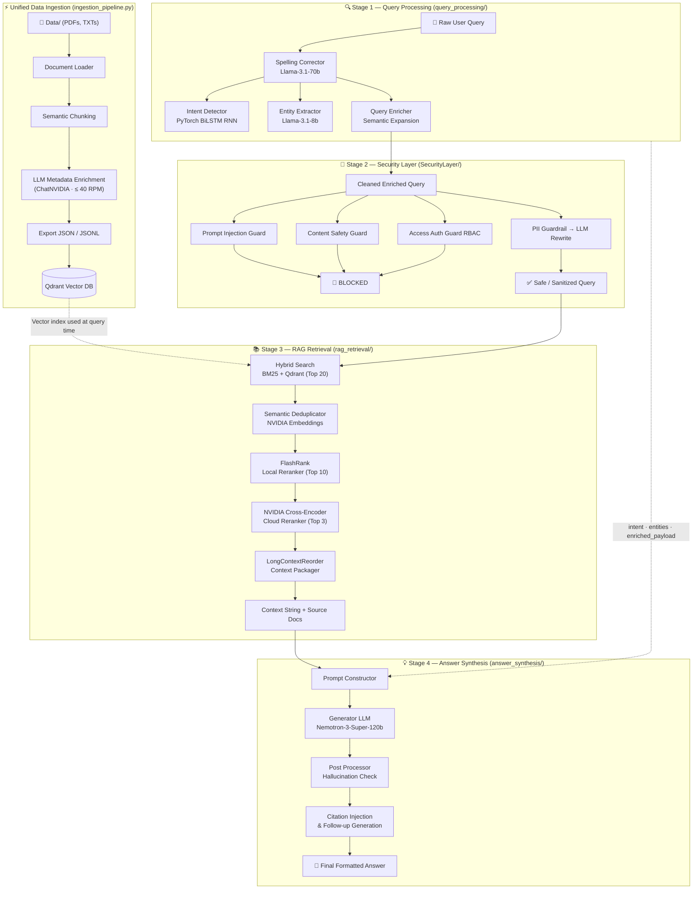

# Multi-Agent Orchestration with RAG & NVIDIA Builder Models

An enterprise-grade financial document ingestion, metadata enrichment, and retrieval pipeline powered by **NVIDIA AI Endpoints**, **Qdrant Vector Database**, and **PyTorch RNNs**. 

This system acts as a secure, intelligent backend that processes complex regulatory and financial documents, indexes them semantically, and orchestrates user queries through a rigorous pipeline of security guardrails, intent classification, query rewriting, hybrid search, and cascaded reranking.

---

## 🤖 Models Used & Their Purposes

This project heavily leverages NVIDIA AI endpoints and HuggingFace models for various discrete tasks, following a multi-agent architectural pattern:

### 1. `meta/llama-3.1-8b-instruct` (via NVIDIA API)
The primary workhorse LLM used for structured data extraction and logical reasoning across multiple modules:
*   **Document Pipeline (`document_pipeline.py`)**: Powers the `ChatNVIDIA.abatch()` calls to extract high-level document metadata (title, summary, domain) and granular chunk-level metadata (entities, synthetic QA pairs, compliance mandates) using strict Pydantic schemas.
*   **Query Enrichment (`query_enrichment.py`)**: Performs semantic expansion and context-aware query rewriting (based on chat history) to optimize the query for vector retrieval.
*   **Query NLP (`QueryNLP/entity_extraction.py`, `QueryNLP/spelling_correction.py`)**: Extracts named entities from raw queries and performs intelligent spelling correction.
*   **Security Layer**: Drives the logic for the `AccessAuthorizationGuard` (RBAC checking), `PromptInjectionGuard` (adversarial detection), and acts as the Privacy Sanitizer in the `SecurityOrchestrator` to rewrite queries that contain sensitive PII.

### 2. `nvidia/nv-embedqa-e5-v5` (via NVIDIA API)
*   **Semantic Chunking (`document_pipeline.py`)**: Used by the `SemanticChunker` to calculate semantic similarity between sentences, determining the optimal breakpoints to split documents contextually rather than arbitrarily.
*   **Vector Database Indexing (`qdrant_indexer.py`)**: Embeds the enriched document chunks into high-dimensional dense vectors to be stored in the persistent Qdrant database.

### 3. `nvidia/llama-nemotron-embed-1b-v2` (via NVIDIA API)
*   **Query Embedding & Deduplication**: A lightweight, highly efficient embedding model used specifically to vectorize incoming user queries rapidly for semantic matching, and for semantic deduplication of retrieved chunks.

### 4. `nvidia/llama-3.1-nemoguard-8b-content-safety` (via NVIDIA API)
*   **Content Safety Guard (`SecurityLayer/content_safety_guard.py`)**: A specialized NeMo Guardrails model used exclusively to detect and block toxic, illegal, or unethical content in user prompts.

### 5. `nvidia/llama-nemotron-rerank-1b-v2` & `FlashRank`
*   **Cascaded Reranking (`rag_retrieval/`)**: FlashRank (`ms-marco-MultiBERT-L-12`) is used locally to quickly filter candidates, followed by the heavy NVIDIA cross-encoder to precisely rerank the absolute best chunks for context assembly.

### 6. `distilbert-base-uncased` + Custom PyTorch BiLSTM
*   **Intent Classification (`QueryNLP/intent_detection.py`)**: A locally trained PyTorch model to classify user queries into specific domain intents (e.g., *Regulatory Guideline*, *Annual Report*).

### 7. `nvidia/nemotron-3-super-120b-a12b` (via NVIDIA API)
*   **Answer Synthesis (`answer_synthesis/generator_llm.py`)**: The primary generator model responsible for synthesizing final comprehensive answers from the highly curated context, strictly enforcing a professional, executive-level tone.

### 8. `vectara/hallucination_evaluation_model` (via HuggingFace/Local)
*   **Post-Processing & Fact Verification (`answer_synthesis/post_processing.py`)**: A local cross-encoder model that evaluates the generated answer against the retrieved context to calculate a factual consistency score. If a hallucination is detected, safety guardrails are dynamically injected.

---

## 📦 Module Usage & Architecture



### 🏗️ Detailed System Workflow Architecture

All modules are now connected into a single, end-to-end pipeline exposed via **`pipeline.py`**:

1. **Query Processing (`query_processing/query_orchestrator.py`)**: The raw user query is first normalized (spelling correction via Llama-3.1-70b), classified by intent (PyTorch BiLSTM), enriched with extracted entities, and semantically expanded via LLM.
2. **Security Gate (`SecurityLayer/security_orchestrator.py`)**: The cleaned query is independently evaluated against all four guards — Prompt Injection, Content Safety, RBAC Authorization, and PII Detection. Blocked queries return an immediate error response. PII-flagged queries are safely rewritten before proceeding.
3. **RAG Retrieval (`rag_retrieval/master_orchestrator.py`)**: The security-cleared query executes a Hybrid Search (BM25 + Qdrant). Results are deduplicated, cascaded-reranked (FlashRank → NVIDIA Cross-Encoder), and reordered via `LongContextReorder` to defeat the "Lost in the Middle" effect.
4. **Answer Synthesis (`answer_synthesis/generator_llm.py`)**: The `PromptConstructor` combines the enriched query metadata (intent, entities) and the curated context string into a structured prompt. The Generator LLM produces the response, which is then evaluated for hallucinations, citation-injected, and given a follow-up suggestion.

### 🚀 End-to-End Query Pipeline (`pipeline.py`) — **Run Queries Here**
*   **Usage**: `python pipeline.py --query "Your question here" --role EMPLOYEE`
*   **Purpose**: The master query entry point that chains all four stages together:
    1. **Stage 1 → Query Processing**: Normalizes, classifies intent, extracts entities, enriches semantically
    2. **Stage 2 → Security Gate**: Blocks injections/toxic content, enforces RBAC, sanitizes PII
    3. **Stage 3 → RAG Retrieval**: Hybrid search → deduplication → cascaded reranking → context packaging
    4. **Stage 4 → Answer Synthesis**: Structured prompt → LLM generation → hallucination check → citation injection
*   **Optional Flags**:
    *   `--query "<text>"` or `-q`: The user query string (required)
    *   `--role GUEST|EMPLOYEE|ADMIN` or `-r`: RBAC user role (default: `EMPLOYEE`)
    *   `--history "<json>"`: JSON array of prior chat turns for context-aware retrieval

---

### 1. ⚡ Unified Ingestion Pipeline (`ingestion_pipeline.py`) — **Start Here**
*   **Usage**: Run `python ingestion_pipeline.py`
*   **Purpose**: The single-entrypoint pipeline that orchestrates the entire data ingestion flow end-to-end:
    1. Loads raw documents from `Data/`
    2. Enriches them with LLM-generated metadata
    3. Exports `processed_documents.json` and `.jsonl` to disk
    4. **Immediately hands off** the enriched documents in-memory to the Qdrant Indexer (no JSON round-trip)
    5. Indexes all chunks into the persistent Qdrant Vector Database
    6. Runs a verification search to confirm everything is working
*   **Optional Flags**:
    *   `--data-dir <path>`: Override the data directory (default: `Data/`)
    *   `--collection <name>`: Override the Qdrant collection name (default: `fintech_documents_optimized`)
    *   `--qdrant-path <path>`: Override the Qdrant DB path (default: `Data/qdrant_db_optimized`)
    *   `--skip-indexing`: Only run document processing and export, skip Qdrant indexing

### 2. Document Processing Pipeline (`document_pipeline.py`) — Standalone
*   **Usage**: Run `python3 document_pipeline.py`
*   **Purpose**: Scans the `Data/` folder for PDFs and TXT files. It loads the text, determines semantic chunk boundaries, extracts structured metadata for every chunk, and saves the highly enriched artifacts to `processed_documents.json` and `processed_documents.jsonl`.
*   **Note**: Features a custom asynchronous sliding-window rate limiter to guarantee API calls stay strictly under 40 RPM.

### 3. Indexing Pipeline (`qdrant_indexer.py`) — Standalone
*   **Usage**: Run `python3 qdrant_indexer.py` (reads from existing `processed_documents.json`)
*   **Purpose**: Standalone bulk-inserts enriched chunks from a pre-existing JSON file into the local persistent Qdrant Vector Database collection using dense vectors.

### 3. Query Processing Pipeline (`query_processing/`)
*   **Usage**: Run `python -m query_processing.query_orchestrator`
*   **Purpose**: Intercepts and enhances user queries before processing using the `QueryOrchestrator`:
    *   **Intent Detection**: Routes the query based on classification via a PyTorch RNN.
    *   **Spelling & Entity Extraction**: Normalizes text and pulls key terms (`query_processing/QueryNLP/`).
    *   **Security Guardrails**: Detects and masks sensitive PII, validates RBAC, blocks toxic inputs, and detects adversarial jailbreak attempts.
    *   **Query Enrichment**: Expands the query semantically and factors in prior conversational chat history (`query_processing/query_enrichment.py`).

### 4. Master RAG Orchestrator (`rag_retrieval/master_orchestrator.py`)
*   **Usage**: Run `python -m rag_retrieval.master_orchestrator`
*   **Purpose**: The central nervous system of the RAG retrieval flow. Connects all modules to execute a flawless context assembly process:
    *   **Secure Hybrid Search**: Combines BM25 and Qdrant dense vector search protected by the SecurityLayer.
    *   **Semantic Deduplication**: Drops redundant candidate chunks (`context_assembly.py`).
    *   **Cascaded Reranking**: Filters candidates rapidly via Local FlashRank, then precisely reranks via Cloud NVIDIA Cross-Encoder (`reranking_pipeline.py`).
    *   **Context Packaging**: Uses LlamaIndex's `LongContextReorder` to position the most critical chunks at the extreme beginning and end of the prompt window to defeat the "Lost in the Middle" LLM hallucination effect.
    *   **Output String Generation**: Automatically compiles the final, curated documents into a structured prompt string ready to be injected into a generator LLM.

### 5. Answer Synthesis Pipeline (`answer_synthesis/`)
*   **Usage**: Run `python -m answer_synthesis.generator_llm`
*   **Purpose**: The final generation and evaluation stage of the pipeline:
    *   **Prompt Construction**: Injects formatting, security, and tone rules (`prompt_construction.py`).
    *   **Generation**: Uses `nvidia/nemotron-3-super-120b-a12b` to synthesize the response.
    *   **Fact Verification & Post-Processing**: Calculates factual consistency using `vectara/hallucination_evaluation_model`, adds confidence scores, extracts citations, suggests follow-up questions, and dynamically prepends safety warnings if hallucinatory behavior is detected (`post_processing.py`).

---

## 🚀 Setup & Installation

### 1. Clone & Install Dependencies
```bash
git clone https://github.com/Vaibhav2005-r/Multi_Agent-Orchestration_with_RAG_-_Neurals.git
cd Multi_Agent-Orchestration_with_RAG_-_Neurals
pip install langchain-nvidia-ai-endpoints langchain-core langchain-qdrant qdrant-client pypdf pymupdf python-dotenv pandas torch transformers nemoguardrails nest_asyncio flashrank llama-index-core
```
> **Note for Windows Users:** The `nemoguardrails` dependency requires [Microsoft C++ Build Tools](https://visualstudio.microsoft.com/visual-cpp-build-tools/) to be installed.

### 2. Configure Environment Variables
Create a `.env` file in the root directory and add your API key from [build.nvidia.com](https://build.nvidia.com):
```env
NVIDIA_API_KEY=nvapi-your_api_key_here
```

---

## 📄 License
MIT License
