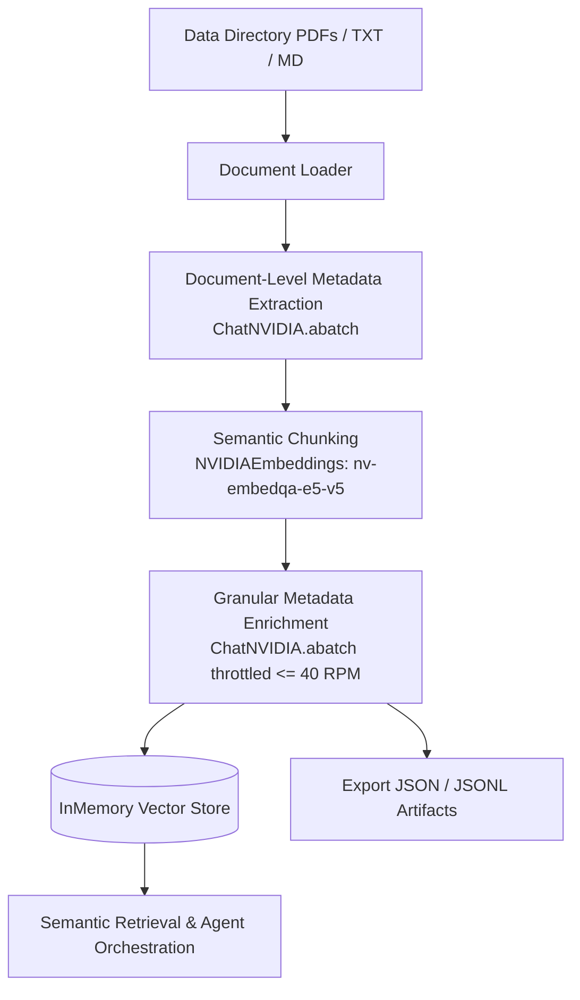

# Multi-Agent Orchestration with RAG & NVIDIA Builder Models

An enterprise-grade financial document ingestion, metadata enrichment, and retrieval pipeline powered by **NVIDIA AI Endpoints** (`ChatNVIDIA` and `NVIDIAEmbeddings`).

---

## 🌟 Key Features

1. **Multi-Format Document Ingestion**:
   - Seamlessly extracts text and page metadata from PDFs, Markdown, and TXT files using PyMuPDF and pdfplumber.
2. **Document-Level Metadata Extraction**:
   - Employs **`meta/llama-3.1-8b-instruct`** with Pydantic structured schemas via **`ChatNVIDIA.abatch()`** to deduce title, document type, issuing authority, key stakeholders, and domain summaries.
3. **Semantic Chunking**:
   - Splits documents into semantically coherent units at contextual inflection points using **`nvidia/nv-embedqa-e5-v5`** embeddings.
4. **Granular Metadata Enrichment with 40 RPM Throttling**:
   - Enriches every chunk with chunk titles, micro-summaries, legal entities, compliance mandates, and synthetic QA pairs.
   - Strictly throttled using a sliding 60-second window rate limiter to guarantee compliance with the **40 RPM** API quota limit.
   - Automatic exponential backoff and retry handling on HTTP 429 errors.
5. **Vector Store & Artifact Serialization**:
   - Indexes all enriched chunks into `InMemoryVectorStore` for low-latency similarity search.
   - Exports enriched knowledge bases into structured `processed_documents.json` and `processed_documents.jsonl`.

---

## 🛠️ Architecture Overview



---

## 📦 Setup & Installation

### 1. Clone & Install Dependencies
```bash
git clone https://github.com/Vaibhav2005-r/Multi_Agent-Orchestration_with_RAG_-_Neurals.git
cd Multi_Agent-Orchestration_with_RAG_-_Neurals
pip install langchain-nvidia-ai-endpoints langchain-core langchain-community langchain-experimental pypdf pymupdf python-dotenv pandas
```

### 2. Configure Environment Variables
Create a `.env` file in the root directory:
```env
NVIDIA_API_KEY=nvapi-your_api_key_here
```

---

## 🚀 Running the Pipeline

### Python Script
```python
from document_pipeline import DocumentPipeline

pipeline = DocumentPipeline(
    llm_model="meta/llama-3.1-8b-instruct",
    embedding_model="nvidia/nv-embedqa-e5-v5",
    batch_size=5,
    max_rpm=40
)

# Run full asynchronous ingestion & enrichment
enriched_chunks = await pipeline.run_pipeline_async(data_dir="Data")

# Perform semantic similarity search
results = pipeline.search("What are the rules regarding loan disbursals?", k=3)
```

### Jupyter Notebooks
- [`pipeline_demo.ipynb`](pipeline_demo.ipynb): Step-by-step interactive demonstration notebook.
- [`pipeline.ipynb`](pipeline.ipynb) / [`document_pipeline.ipynb`](document_pipeline.ipynb): Interactive pipeline workflow.

---

## 📄 License
MIT License
